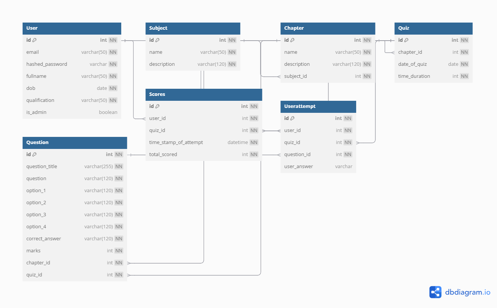

# Quiz Master App 🎯  

## Project Description  
The **Quiz Master App** allows users to participate in quizzes, track their scores, and analyze performance. The project follows a **web-based exam system** layout.  

## Technologies Used 🛠  
- **Backend**: Python, Flask, Flask-SQLAlchemy  
- **Frontend**: HTML, CSS, JavaScript, Jinja  
- **Database**: SQLite  
- **Charts & Analytics**: Matplotlib  

## Database Schema Design 🗄  
  

- **User** has `7 attributes` with `id` as the **primary key**  
- **Subject** has `3 attributes` with `id` as the **primary key**  
- **Chapter** has `4 attributes` with `id` as the **primary key**, `subject_id` as the **foreign key**  
- **Quiz** has `5 attributes` with `id` as the **primary key**, `chapter_id` as the **foreign key**  
- **Scores** has `4 attributes` with `id` as the **primary key**, `user_id` and `quiz_id` as **foreign keys**  

## API Endpoints 🌐  
- **User Authentication**: Register & Login  
- **Subjects & Chapters**: Create, Read, Update, Delete (CRUD)  
- **Quizzes & Questions**: CRUD operations  
- **API Docs**: [SwaggerHub](https://app.swaggerhub.com/apis/NirmalS/quiz-master_api/1.0.0)  

## Note:
   - To run use **python app.py** or **flask run** in terminal
